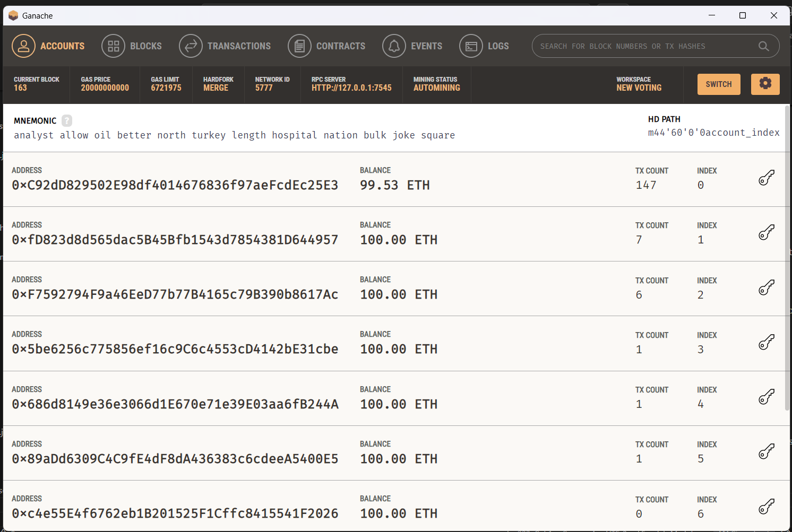
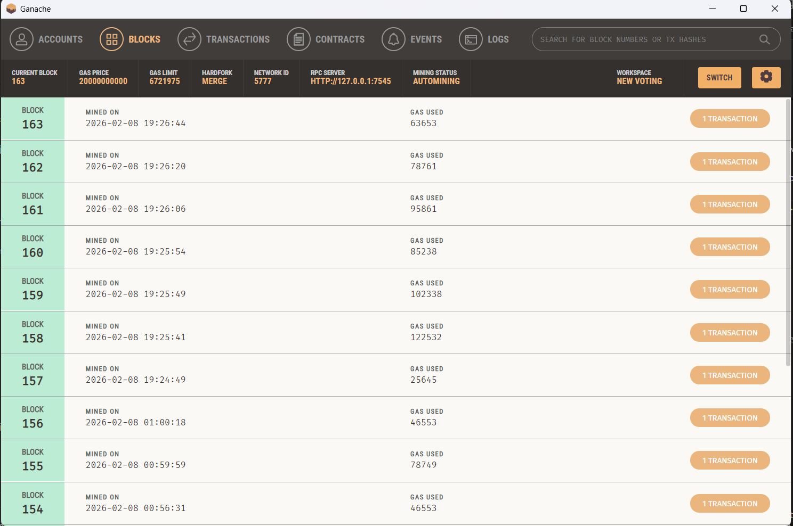
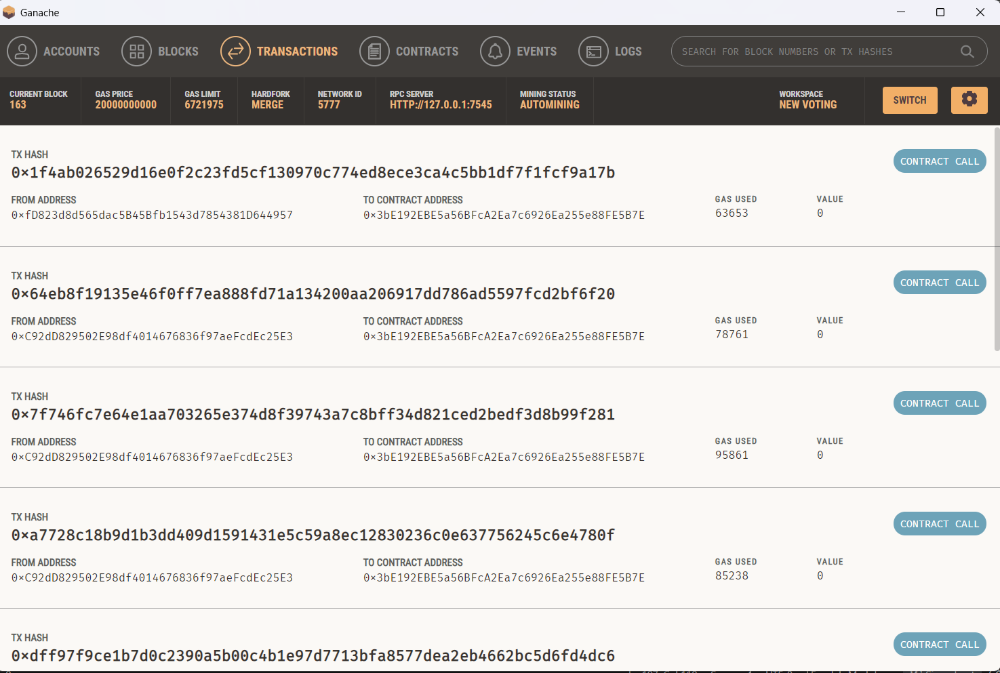
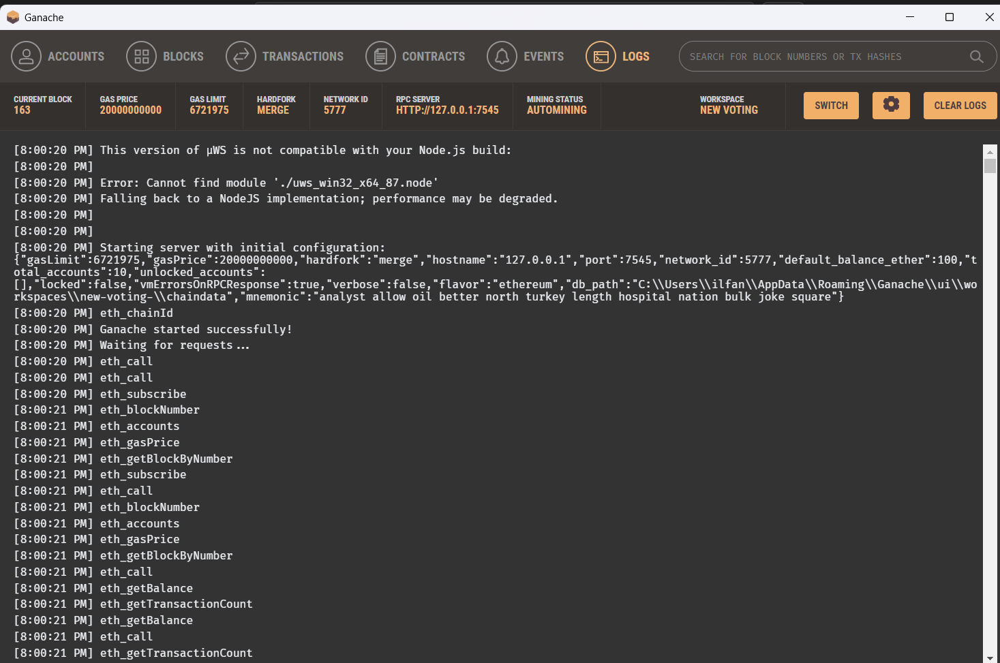

---

# 🛡️ VoteChain Pro

## Decentralized Blockchain-Based E-Voting System

---

## 📌 Overview

VoteChain Pro is a secure, transparent, and tamper-proof electronic voting system built on the Ethereum blockchain.
It eliminates centralized control, prevents vote manipulation, and enforces one-person-one-vote using immutable smart contracts.

Unlike traditional voting systems that depend on centralized servers and SQL databases, VoteChain Pro uses the Ethereum Virtual Machine (EVM) as its backend.

---

## 🎯 Objectives

- Eliminate election fraud and vote tampering
- Ensure transparency and public auditability
- Remove single points of failure
- Demonstrate decentralized governance using blockchain
- Serve as an academic and portfolio-grade blockchain project

---

## 🧠 Design Philosophy

“Don’t trust authorities — verify the code.”

VoteChain Pro replaces:

- Centralized servers
- Admin-controlled databases
- Password-based authentication

With:

- Immutable smart contracts
- Cryptographic identity (private keys)
- Decentralized consensus

---

## 🏗️ System Architecture

### Dual-Layer Architecture

Administrator (Election Commission)

- Deploy elections
- Add candidates
- Whitelist voters

Voter

- Authenticate using blockchain identity
- Cast a vote securely

There is no traditional backend server.
The blockchain itself acts as the backend.

---

## 📸 Project Demo Screenshots

### Admin Dashboard

Deploy elections, add candidates, and whitelist voters.

---

### Voter Portal

Secure private-key login with automatic eligibility detection.

---

### Real-Time Results Dashboard

Live graphical election results fetched directly from the blockchain.

---

## 🧾 Ganache Local Blockchain Guide

### Accounts

Ganache provides 10 pre-funded Ethereum accounts for development.

- Each account has 100 ETH (test ether)
- Private keys are visible for testing
- A 12-word mnemonic allows deterministic recovery

---

### Blocks

Ganache uses instant mining (automine) for faster development.

- Each transaction instantly creates a block
- Block data includes timestamp, gas used, and transactions

---

### Transactions

Every blockchain interaction is logged transparently.

- Contract deployments
- Function calls
- Vote transactions
- Reverted or successful transaction status

---

### Logs and Events

Smart contract events and JSON-RPC calls are visible for debugging.

- Solidity emit events
- Gas errors
- Revert reasons

---

## 🆚 Blockchain vs Traditional Voting Systems

| Feature        | Traditional System | VoteChain Pro |
| -------------- | ------------------ | ------------- |
| Data Integrity | Admin-modifiable   | Immutable     |
| Transparency   | Opaque             | Public ledger |
| Availability   | Central server     | Decentralized |
| Authentication | Password-based     | Cryptographic |
| Auditability   | Limited            | Full          |

---

## 🛠️ Technology Stack

- Smart Contracts: Solidity (v0.8.x)
- Development Framework: Hardhat
- Blockchain Network: Ethereum
- Local Blockchain: Ganache (Port 7545)
- Frontend: HTML5, Tailwind CSS, Vanilla JavaScript
- Web3 Library: Ethers.js v5
- Visualization: Chart.js

---

## 🚀 Installation and Setup

### Prerequisites

- Node.js v14 or higher
- Ganache running on port 7545
- Visual Studio Code

---

### Initialize Project

npm init -y
npm install --save-dev hardhat @nomiclabs/hardhat-ethers ethers
npx hardhat

---

### Hardhat Configuration

require("@nomiclabs/hardhat-ethers");

module.exports = {
solidity: "0.8.19",
networks: {
ganache: {
url: "[http://127.0.0.1:7545](http://127.0.0.1:7545)",
chainId: 1337
}
}
};

---

### Compile Smart Contract

npx hardhat compile

---

### Deploy Contract

npx hardhat run scripts/deploy.js --network ganache

---

### Connect Frontend

- Copy deployed contract address from terminal
- Paste it into index.html
- Launch the app using Live Server

---

## 🧑‍💼 Administrator Workflow

1. Login using private key of Ganache Account #0
2. Deploy election
3. Add candidates
4. Whitelist voter addresses

---

## 🗳️ Voter Workflow

1. Login using private key of any other Ganache account
2. Check eligibility status
3. Cast vote
4. View live election results

---

## ⚠️ Important Notes

- Restarting Ganache resets the blockchain
- Redeployment is required after every reset
- Private-key login is for educational purposes only
- Production systems should use MetaMask or WalletConnect

---

## 📄 License

This project is licensed under the MIT License.

---
