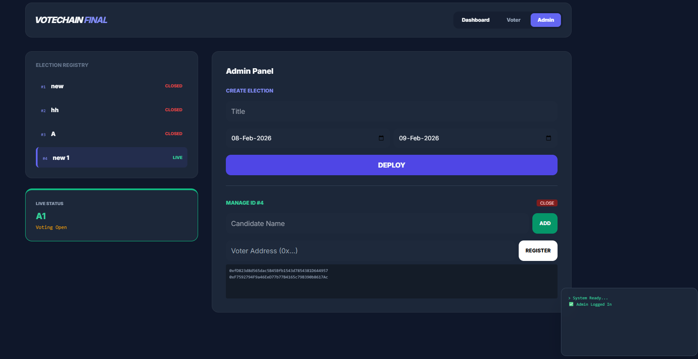
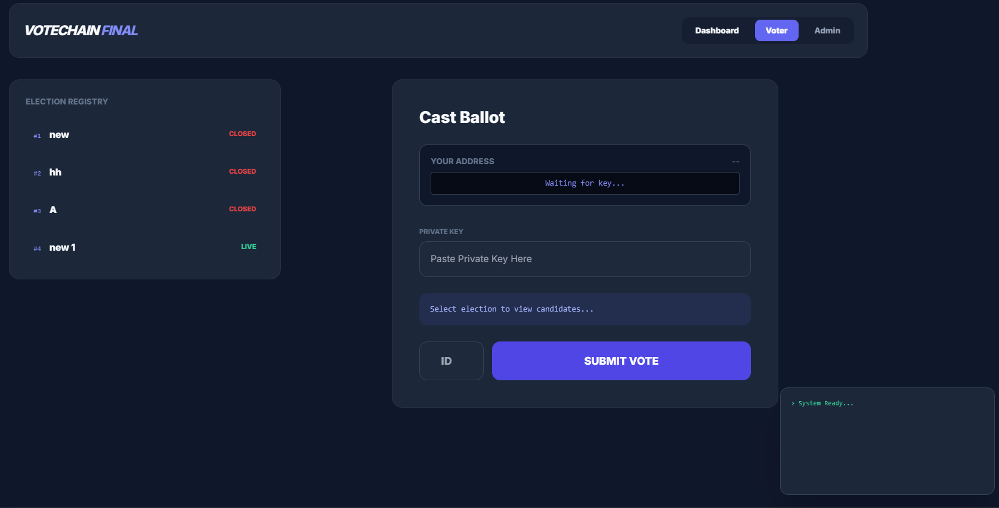
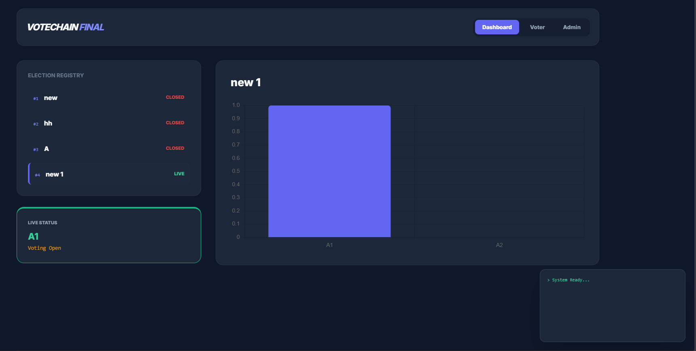

# VoteChain Pro: Decentralized Governance System 🛡️


**VoteChain Pro** is a secure, blockchain-based electronic voting system designed to eliminate fraud and ensure transparency in elections. Built on the **Ethereum** network using **Hardhat** for development, it replaces traditional centralized databases with immutable smart contracts.

The system features a **Dual-Layer Architecture** separating the Administrator (Election Commission) from the Voter, secured by **Public-Key Cryptography**.

---

## 📸 Project Demo

### 1. Admin Dashboard

_Deploy elections, add candidates, and whitelist voters._
!

### 2. Voter Portal

_Secure login with Private Key and real-time eligibility checking._


### 3. Real-Time Results

_Live graphical updates of election standings._


---

## 🏗️ System Architecture

VoteChain does not rely on a traditional backend server (like Node.js or Python) or a centralized database (like MySQL). The "Backend" is the **Ethereum Virtual Machine (EVM)** itself.

### 1. Smart Contract (`contracts/Election.sol`)

The core logic is an autonomous Solidity contract that:

- **Enforces State:** Manages `active` or `closed` election states based on Unix timestamps.
- **Immutable Storage:** Uses `structs` and `mappings` to permanently store candidates and votes on the ledger.
- **Logic Processing:** Executes the "One Person, One Vote" rule cryptographically.

### 2. Deployment Pipeline (`scripts/deploy.js`)

We use **Hardhat** to orchestrate the lifecycle of the application:

- **Compilation:** Converts Solidity code into EVM bytecode and ABIs.
- **Deployment:** Scripts automate the deployment to local (Ganache) or public testnets (Sepolia).
- **Verification:** Ensures contract integrity before user interaction.

---

## 🆚 Blockchain vs. Traditional Systems

| Feature            | ❌ Traditional Voting (SQL)                                        | ✅ VoteChain Pro (Blockchain)                                               |
| :----------------- | :----------------------------------------------------------------- | :-------------------------------------------------------------------------- |
| **Data Integrity** | **Vulnerable.** Admins with root access can alter database values. | **Immutable.** Once a vote is mined, it cannot be changed or deleted.       |
| **Transparency**   | **Opaque.** The public must trust the central authority.           | **Transparent.** The ledger is public; anyone can audit the code and votes. |
| **Availability**   | **Centralized.** Single point of failure (server crash/DDoS).      | **Decentralized.** 100% uptime distributed across the network.              |
| **Authentication** | **Password-based.** Weak against phishing/leaks.                   | **Cryptographic.** Impossible to forge a vote without the Private Key.      |

---

## 🛠️ Technology Stack

- **Smart Contracts:** Solidity (v0.8.x)
- **Development Framework:** Hardhat
- **Local Blockchain:** Ganache (Port 7545)
- **Frontend Library:** Ethers.js v5
- **Interface:** HTML5, Tailwind CSS, Vanilla JS
- **Visualization:** Chart.js

---

## 🚀 Installation & Setup Guide

Follow these steps to build, compile, and deploy the system from scratch.

### 1. Prerequisites

- [Node.js](https://nodejs.org/) (v14 or higher)
- [Ganache](https://trufflesuite.com/ganache/) (Running on port `7545`)
- [VS Code](https://code.visualstudio.com/)

### 2. Initialize Project

Open your terminal in the project folder and run these commands:

```bash
# Initialize a new Node.js project
npm init -y

# Install Hardhat and Ethers.js dependencies
npm install --save-dev hardhat @nomiclabs/hardhat-ethers ethers

# Configure Hardhat
#Run the initialization command:

npx hardhat

#Then, open hardhat.config.js and update it to connect to Ganache:

JavaScript
require("@nomiclabs/hardhat-ethers");

module.exports = {
  solidity: "0.8.19",
  networks: {
    ganache: {
      url: "[http://127.0.0.1:7545](http://127.0.0.1:7545)", // Standard Ganache Port
      chainId: 1337
    }
  }
};

# The Smart Contract
Ensure your contract file is placed at contracts/Election.sol.

# Compile the Contract
Compile your Solidity code into artifacts that the frontend can read:


npx hardhat compile
#Output should say: Compiled 1 Solidity file successfully

# The Deployment Script
Create a file named scripts/deploy.js with the following content:

JavaScript
const hre = require("hardhat");

async function main() {
  const Election = await hre.ethers.getContractFactory("Election");
  console.log("Deploying Election contract...");
  const election = await Election.deploy();
  await election.deployed();
  console.log("✅ Election Contract deployed to:", election.address);
}

main().catch((error) => {
  console.error(error);
  process.exitCode = 1;
});

# Deploy to Local Blockchain
Run the deployment script pointing to your Ganache network:


npx hardhat run scripts/deploy.js --network ganache
Terminal Output:

Plaintext
Deploying Election contract...
✅ Election Contract deployed to: 0x3bE192... (Your Address)


. Connect Frontend
Copy the Deployed Address from your terminal output above.

Open index.html.

Update the configuration line:

JavaScript
const CONTRACT_ADDRESS = "0x3bE192..."; // Paste new address here
Launch the app using Live Server.

# 📖 Usage Manual
# 🏛️ Administrator Workflow
Login: Use the Private Key of Account #0 from Ganache (The Owner).

Deploy Election: Fill in "Title", "Start Date", and "End Date". Click Deploy.

Manage: Add Candidates and Whitelist Voter addresses.

# 🗳️ Voter Workflow
Login: Use the Private Key of any other account (e.g., Account #1 or #2).

Check Status: The dashboard will auto-detect your address and show "Eligible" or "Not Registered".

Vote: Enter the ID of the election and the Candidate ID. Click Submit Vote.

# ⚠️ Important Notes
Artifacts: After running npx hardhat compile, Hardhat creates an artifacts/ folder. This contains the ABI needed for the frontend.

Persistence: If you restart Ganache (Quickstart), the blockchain resets. You must run npx hardhat run scripts/deploy.js --network ganache again to get a new contract address.

Security: This project uses private key pasting for educational demonstration. Production builds should use MetaMask or WalletConnect.

```
